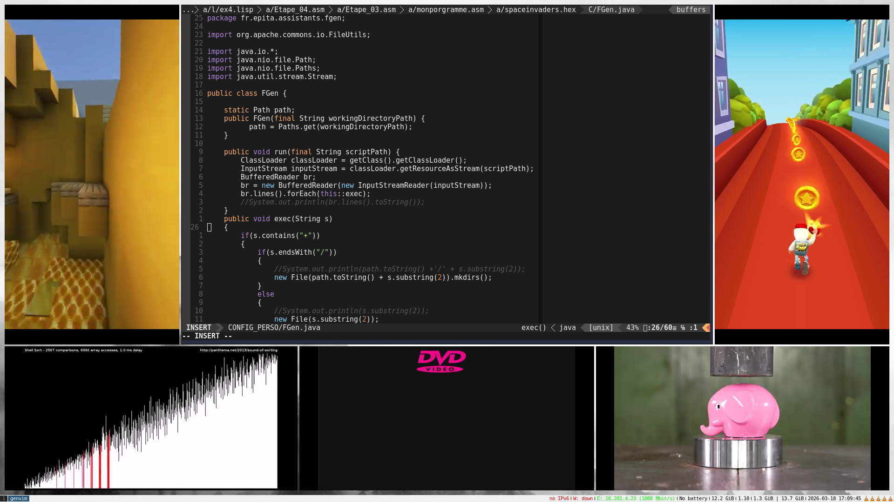

# GENVIM

Are you distracted in class because your classmates are too noisy?  
Do you procrastinate when you’re trying to code?  
Or worse, do you rely on AI the moment you get stuck on a practical assignment?

Introducing **GENVIM**, a radically new way to work, far more efficiently.  
**+167% focus**, scientifically proven by Thomas and Patrick.

This is not a program.  
It’s an idea.  
And that idea lives within you.

## Installation

1. Untar the newest release in your **AFS**:

```sh
tar xvf gen_vim-genv.tar.gz
```

2. Move into the project directory:

```sh
cd gen_vim-genv/genvimSetup/
```

3. Run the setup script:

```sh
./setup.sh
```

That’s it. **GENVIM is now ready.**

## Usage

Launch `genvim` from your terminal, with or without arguments *(just like vim)*:

```sh
genvim
```

A new virtual desktop named **"genvim"** will automatically be created.

To switch to it, use your system bind key *(commonly the Windows key)* + `w`.

**You may have to relaunch one more time due to VLC issues.**


*Example of the default genvim configuration*

You are now isolated.  
No noise.  
No distractions.  
No excuses.

## Philosophy

**GENVIM** is not software.  
**GENVIM** is discipline.  
**GENVIM** is focus.  
**GENVIM** is a mindset.

It forces you into a clean workspace dedicated only to productivity.

- No browser tabs  
- No social media (almost)  
- No unnecessary tools (still almost)  
Just you and your code.

## Why GENVIM?

Because focus is not optional.  
Because procrastination is a bug.  
Because discipline scales.  
Because Generation Z deserves better.

What are you waiting for? Embrace the **GENVIM mindset**.

by Thomas and Patrick (and Axel for the advertisment)
